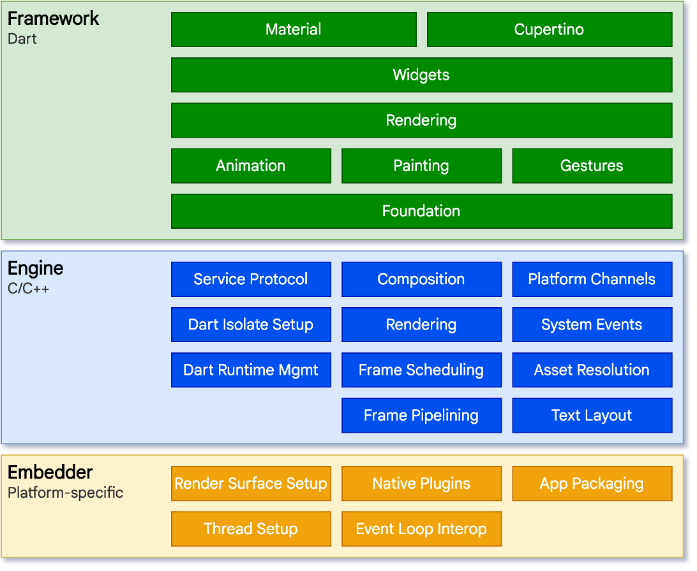
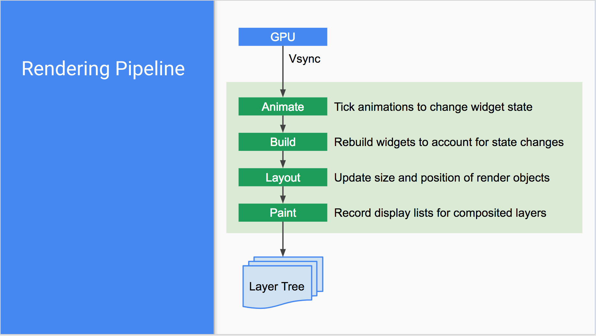
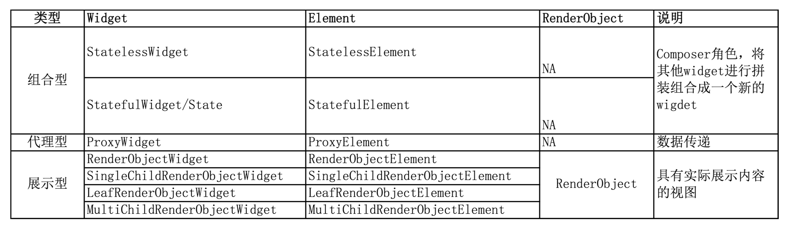
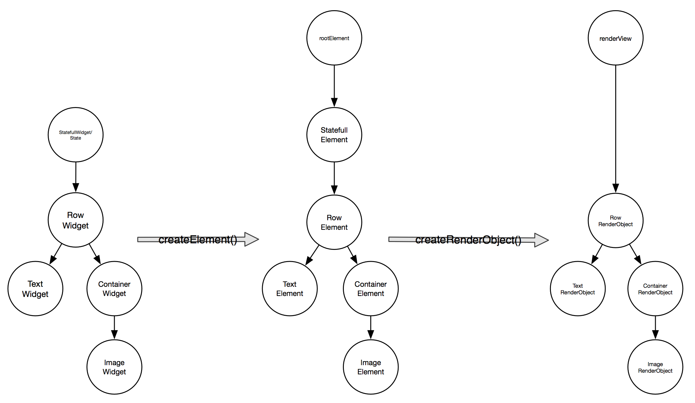
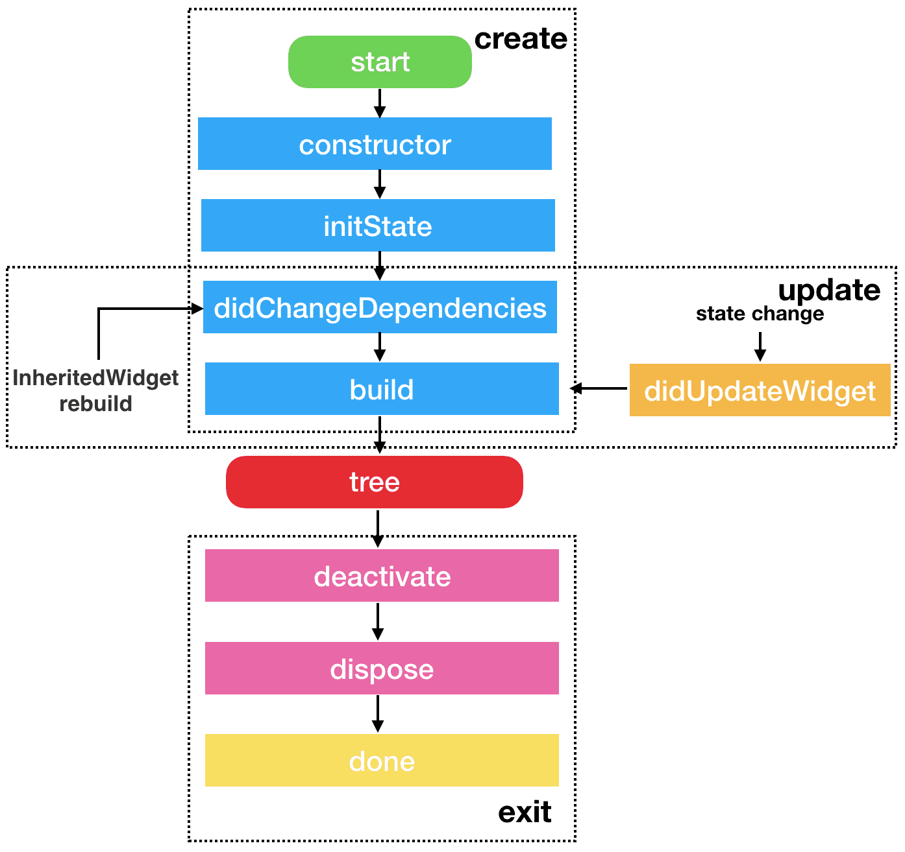

本文旨在记录分析Flutter的渲染原理和设计理念，参考了一些文档和博客，方便Flutter开发者学习交流。

<!--more-->

# 什么是Flutter
Flutter 是一个跨平台的 UI 工具集，帮助开发者通过一套代码库高效构建多平台精美应用。

## 框架简介
### 嵌入层
对于底层操作系统而言，Flutter 应用程序的包装方式与其他原生应用相同。在每一个平台上，会包含一个特定的嵌入层，从而提供一个程序入口，程序由此可以与底层操作系统进行协调，访问诸如 surface 渲染、辅助功能和输入等服务，并且管理事件循环队列。该嵌入层采用了适合当前平台的语言编写，例如 Android 使用的是 Java 和 C++， iOS 和 macOS 使用的是 Objective-C 和 Objective-C++，Windows 和 Linux 使用的是 C++。 Flutter 代码可以通过嵌入层，以模块方式集成到现有的应用中，也可以作为应用的主体。 Flutter 本身包含了各个常见平台的嵌入层。

### 引擎层
Flutter 引擎 是 Flutter 的核心，它主要使用 C++ 编写，并提供了 Flutter 应用所需的原语。当需要绘制新一帧的内容时，引擎将负责对需要合成的场景进行栅格化。它提供了 Flutter 核心 API 的底层实现，包括图形（通过 Skia）、文本布局、文件及网络 IO、辅助功能支持、插件架构和 Dart 运行环境及编译环境的工具链。
引擎将底层 C++ 代码包装成 Dart 代码，通过 dart:ui 暴露给 Flutter 框架层。该库暴露了最底层的原语，包括用于驱动输入、图形、和文本渲染的子系统的类。

### 框架层
通常，开发者可以通过 Flutter 框架层 与 Flutter 交互，该框架提供了以 Dart 语言编写的现代响应式框架。它包括由一系列层组成的一组丰富的平台，布局和基础库。从下层到上层，依次有：

基础的 foundational 类及一些基层之上的构建块服务，如 animation、 painting 和 gestures，它们可以提供上层常用的抽象。

渲染层：用于提供操作布局的抽象。有了渲染层，你可以构建一棵可渲染对象的树。在你动态更新这些对象时，渲染树也会自动根据你的变更来更新布局。

widget层： 是一种组合的抽象。每一个渲染层中的渲染对象，都在 widgets 层中有一个对应的类。此外，widgets 层让你可以自由组合你需要复用的各种类。响应式编程模型就在该层级中被引入。

Material 和 Cupertino 库提供了全面的 widgets 层的原语组合，这套组合分别实现了 Material 和 iOS 设计规范。



# 渲染原理
## 渲染管道


## 视图树


## 创建树
1. 创建widget树
2. 调用runApp(rootWidget)，将rootWidget传给rootElement,做为rootElement的子节点,生成Element树，由Element树生成Render树。



- Widget:存放渲染内容、视图布局信息,widget的属性最好都是immutable
- Element:存放上下文，通过Element遍历视图树，Element同时持有Widget和RenderObject
- RenderObject:根据Widget的布局属性进行layout，paint Widget传人的内容

## 更新树 
### 为什么widget都是immutable？
flutter界面开发是一种响应式编程，主张simple is fast，flutter设计的初衷希望数据变更时发送通知到对应的可变更节点（可能是一个StatefullWidget子节点,也可以是rootWidget）,由上到下重新create widget树进行刷新，这种思路比较简单，不用关心数据变更会影响到哪些节点。

### widget重新创建，element树和renderObject树是否也重新创建？
widget只是一个配置数据结构，创建是非常轻量的，加上flutter团队对widget的创建/销毁做了优化，不用担心整个widget树重新创建所带来的性能问题，但是renderobject就不一样了，renderobject涉及到layout、paint等复杂操作，是一个真正渲染的view，整个view 树重新创建开销就比较大，所以答案是否定的。

### 树的更新规则
1. 找到widget对应的element节点，设置element为dirty，触发drawframe, drawframe会调用element的performRebuild()进行树重建
2. widget.build() == null, deactive element.child,删除子树，流程结束
3. element.child.widget == NULL, mount 的新子树，流程结束
4. element.child.widget == widget.build() 无需重建，否则进入流程5
5. Widget.canUpdate(element.child.widget, newWidget) == true，更新child的slot，element.child.update(newWidget)(如果child还有子节点，则递归上面的流程进行子树更新),流程结束，否则转6
6. Widget.canUpdate(element.child.widget, newWidget) ！= true（widget的classtype 或者 key 不相等），deactivew element.child，mount 新子树

注意事项：
1. element.child.widget == widget.build(),不会触发子树的update，当触发update的时候，如果没有生效，要注意widget是否使用旧widget，没有new widget，导致update流程走到该widget就停止了
2. 子树的深度变化，会引起子树重建，如果子树是一个复杂度很高的树，可以使用GlobalKey做为子树widget的key。GlobalKey具有缓存功能

### 如何触发树更新
1. 全局更新：调用runApp(rootWidget)，一般flutter启动时调用后不再会调用
2. 局部子树更新, 将该子树做StatefullWidget的一个子widget，并创建对应的State类实例，通过调用state.setState() 触发该子树的刷新

# 生命周期
widget是immutable的，发生变化的时候需要重建，所以谈不上状态。StatefulWidget 中的状态保持其实是通过State类来实现的。State拥有一套自己的生命周期。

名称 | 状态
---|---
initState | 插入渲染树时调用，只调用一次
didChangeDependencies | state依赖的对象发生变化时调用
didUpdateWidget | 组件状态改变时候调用，可能会调用多次
build | 构建Widget时调用
deactivate | 当移除渲染树的时候调用
dispose | 组件即将销毁时调用
reassemble | hot reload调用



几个注意点
- didChangeDependencies有两种情况会被调用。
    - 创建时候在initState 之后被调用
    - 在依赖的InheritedWidget发生变化的时候会被调用
- 正常的退出流程中会执行deactivate然后执行dispose。但是也会出现deactivate以后不执行dispose，直接加入树中的另一个节点的情况。
- 这里的状态改变包括两种可能：1.通过setState内容改变 2.父节点的state状态改变，导致孩子节点的同步变化。
- A页面push一个新的页面B,A页面的widget树中的所有state会依次调用deactivate(), didUpdateWidget(newWidget)、build()（这里怀疑是bug，A页面push一个新页面，理论上并没有将A页面进行remove操作），当然从功能上，没有看出来有什么异常
- 当ListView中的item滚动出可显示区域的时候，item会被从树中remove掉，此item子树中所有的state都会被dispose，state记录的数据都会销毁，item滚动回可显示区域时，会重新创建全新的state、element、renderobject
- 使用hot reload功能时，要特别注意state实例是没有重新创建的，如果该state中存在一下复杂的资源更新需要重新加载才能生效，那么需要在reassemble()添加处理，不然当你使用hot reload时候可能会出现一些意想不到的结果，例如，要将显示本地文件的内容到屏幕上，当你开发过程中，替换了文件中的内容，但是hot reload没有触发重新读取文件内容，页面显示还是原来的旧内容

# APP生命周期
需要通过WidgetsBindingObserver的didChangeAppLifecycleState 来获取。通过该接口可以获取是生命周期在AppLifecycleState类中。常用状态包含如下几个：
名称 | 状态
---|---
resumed | 可见并能响应用户的输入
inactive | 处在并不活动状态，无法处理用户响应
paused | 不可见并不能响应用户的输入，但是在后台继续活动中

# 数据流转
## 从上往下
数据从根往下传数据，常规做法是一层层往下，当深度变大，数据的传输变的困难，flutter提供InheritedWidget用于子节点向祖先节点获取数据的机制，如下例子：
```dart
class FrogColor extends InheritedWidget {
   const FrogColor({
     Key key,
     @required this.color,
     @required Widget child,
   }) : assert(color != null),
        assert(child != null),
        super(key: key, child: child);
   final Color color;
   static FrogColor of(BuildContext context) {
     return context.inheritFromWidgetOfExactType(FrogColor);
   }
   @override
   bool updateShouldNotify(FrogColor old) => color != old.color;
}
```

child及其以下的节点可以通过调用下面的接口读取color数据`FrogColor.of(context).color`

说明：BuildContext 就是Element的一个接口类

`context.inheritFromWidgetOfExactType(FrogColor)`其实是通过context/element往上遍历树，查找到第一个FrogColor的祖先节点，取该节点的widget对象。

## 从下往上
子节点状态变更，向上上报通过发送通知的方式
- 定义通知类，继承至Notification
- 父节点使用NotificationListener 进行监听捕获通知
- 子节点有数据变更调用下面接口进行数据上报`Notification(data).dispatch(context)`

# Widget
## StatefulWidget
有状态组件，一般形态：
```dart
class MyWidgetRoute extends StatefulWidget {
    @override
    State<StatefulWidget> createState() {
        return _MyWidgetRouteState();
    }
}

class _MyWidgetRouteState extends State<MyWidgetRoute> {
    @override
    void initState() {
        super.initState();
        // ...
    }
    
    @override
    Widget build(BuildContext context) {
        return Scaffold(
            // ...
        );
    }
}
```

## RouteObserver
路由观察器，用来监听路由变化。
```dart
// 注册RouteObserver.
final RouteObserver<PageRoute> routeObserver = RouteObserver<PageRoute>();
void main() {
  runApp(MaterialApp(
    home: Container(),
    navigatorObservers: [routeObserver],
  ));
}

// 在页面组件使用
class RouteAwareWidget extends StatefulWidget {
  State<RouteAwareWidget> createState() => RouteAwareWidgetState();
}

// Implement RouteAware in a widget's state and subscribe it to the RouteObserver.
class RouteAwareWidgetState extends State<RouteAwareWidget> with RouteAware {

  @override
  void didChangeDependencies() {
    super.didChangeDependencies();
    routeObserver.subscribe(this, ModalRoute.of(context));
  }

  @override
  void dispose() {
    routeObserver.unsubscribe(this);
    super.dispose();
  }

  @override
  void didPush() {
    // Route was pushed onto navigator and is now topmost route.
  }

  @override
  void didPopNext() {
    // Covering route was popped off the navigator.
  }

  @override
  Widget build(BuildContext context) => Container();

}
```

## StreamBuilder
流媒体

## Container
用来包裹widget，类似于div，可以设置背景色、大小之类的。举例：
```dart
Container(
    decoration: BoxDecoration( // 盒子模型
        color: const Color(0xff7c94b6),
        border: Border.all(
          color: Colors.black,
          width: 8,
        ),
        borderRadius: BorderRadius.circular(12),
    )
)
```

## Stack
用于样式堆叠
### Positioned
用于Stack的child样式定位。类似于`position: fixed;`举例：
```dart
Stack(
    fit: StackFit.expand,
    alignment: Alignment.center,
    children: [
        Positioned(
            child: Column(),
            top: MediaQuery.of(context).vewPadding.top + 100, // 离顶部100px
        ),
        Positioned(
            child: Column(),
            bottom: MediaQuery.of(context).viewPadding.bottom + 100, // 离底部100px
        ),
        Positioned.fill( // 创建top、right、bottom、left默认为0的widget
            child: Row(),
        )
    ]
)
```

## Column
垂直排列child，相当于`justify-content: column;`

## Row
水平排列child，相当于`justify-content: row;`

## SizedBox
创建一个长宽固定的box
```dart
SizedBox(
    width: 200,
    height: 50,
    child: Button()
)

SizedBox( // 长宽自动撑满父元素
    width: double.infinity,
    height: double.infinity,
)
```

## Text
设置文本
```dart
Text(
    'title',
    textAlign: TextAlign.center,
    overflow: TextOverflow.ellipsis,
    style: TextStyle(
        color: Colors.black.withOpacity(0.9),
        fontSize: 17,
        fontWeight: FontWeight.w500
    ),
),

// 创建能包含不同样式的inline span
Text.rich(
  TextSpan(
    text: 'Hello', // default text style
    children: <TextSpan>[
      TextSpan(text: ' beautiful ', style: TextStyle(fontStyle: FontStyle.italic)),
      TextSpan(text: 'world', style: TextStyle(fontWeight: FontWeight.bold)),
    ],
  ),
)
```

持续更新。。。

> 参考资料
> [深入了解Flutter界面开发](https://www.yuque.com/xytech/flutter/tge705)
> [Flutter Doc](https://docs.flutter.dev/)
